# make-some-noise
An edit of FastNoise_Java by Auburns, improving GWT behavior and adding features.

This is a single-file library, pretty much, for generating various kinds of continuous noise,
such as Perlin and Simplex noise. There are separate tests and visualizers used to ensure
the noise is doing what it should, but if you want to use this library you really only need
to copy Noise.java into your own codebase. If you want to be able to update more easily and
don't need to edit this code, you can use a JAR from the Releases tab, or get this as a Maven
or Gradle dependency from Maven Central:

For Maven,

```xml
<dependency>
  <groupId>com.github.tommyettinger</groupId>
  <artifactId>make_some_noise</artifactId>
  <version>0.3</version>
</dependency>
```

or for Gradle,

```groovy
implementation "com.github.tommyettinger:make_some_noise:0.3"
```
(You may need to change `implementation` to `api` or the older `compile` for some projects.)

This library is GWT-compatible; if you use this with GWT, add the following to your .gwt.xml file:
```xml
<inherits name='make.some.noise' />
```
and also add the following to your `html/build.gradle` `dependencies {}` section:
```groovy
dependencies {
    ...
    implementation "com.github.tommyettinger:make_some_noise:0.3:sources"
}
```
## But What Can It Do?

Lots of noise stuff! You can construct a Noise object with some initial configuration (it
can all be changed later), like the seed, frequency, noise type (the default is
`SIMPLEX_FRACTAL`), and how many octaves to use for fractal noise types.
You can do the standard layering of different octaves of noise using the "_FRACTAL" noise
types, like `SIMPLEX_FRACTAL`, `PERLIN_FRACTAL`, or `FOAM_FRACTAL`, by specifying more than
one octave and possibly setting the fractal type with `noise.setFractalType(Noise.FBM)`.
You can use other fractal types, such as `BILLOW` (which produces more high values with
lines of very dark values) and `RIDGED_MULTI` (which produces mostly low values with fiery
streaks of high values); these often look quite different as octaves are added! You can
adjust the "lacunarity" and "gain" when using multiple octaves; these affect how much the
frequency changes between octaves and how much the contribution changes, respectively. Noise
this produces is supposed to always be between -1.0 and 1.0; some bugs are entirely likely
when fiddling with lacunarity and gain on some fractal types (especially `BILLOW`), but as
long as lacunarity and gain are their default values, all of the noise types and fractal
types should stay in that range.

## Is Anything... Different?

Yes, some types of noise are new here. The `FOAM`, `HONEY`, and `MUTANT` types of noise weren't
part of FastNoise (nor were their fractal variants). `FOAM` works by making several calls to
value noise with differently rotated grids, and with the results of earlier calls domain-warping
the inputs to later calls; these value noise results are averaged, and the result is pushed
towards less-centrally-biased values using a configurable spline. The combination of
differently-rotated grids is very good at eliminating the square-grid artifacts of value
noise. `HONEY` works by averaging a simplex noise call (which uses a roughly triangular grid)
and a value noise call (which uses a square grid), then pushing the values away from their
central bias (which would normally be caused by the averaging). This also tends to break up
the honeycomb patterns in its sources, and is faster than `FOAM`. `HONEY` is useful when you
want the smooth shapes of `SIMPLEX`, but also want to permit larger areas to be all-high or
all-low (`SIMPLEX` always has a low area near each high area with one octave). `MUTANT` is
just like `FOAM` with an extra dimension, so 2D `MUTANT` noise looks like a slice of 3D `FOAM`
noise. You can configure this extra value using `setMutation()`; this is similar to changing
the seed, but small changes to the mutation result in only small changes to the shape of the
noise (this is unlike small changes to the seed, where any changes make very different noise).
Of course, this is not without a tradeoff; `MUTANT` noise is the slowest here.

## Previews of Noise Types

All are 2D. FRACTAL types use 3 octaves.

- VALUE: 
  - 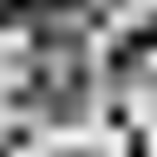
- VALUE_FRACTAL: 
  - 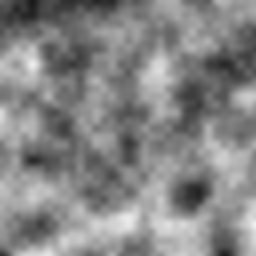
- PERLIN: 
  - 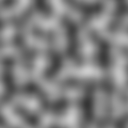
- PERLIN_FRACTAL: 
  - 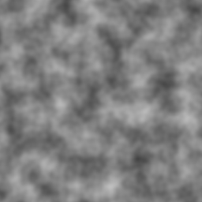
- SIMPLEX: 
  - 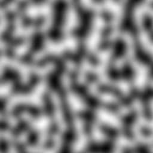
- SIMPLEX_FRACTAL: 
  - 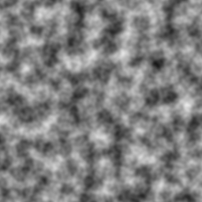
- CELLULAR: 
  - 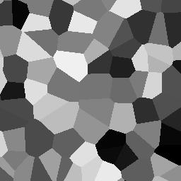
- WHITE_NOISE: 
  - 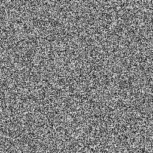
- CUBIC: 
  - 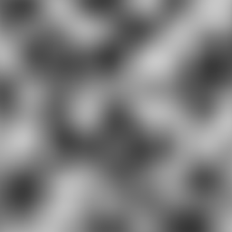
- CUBIC_FRACTAL: 
  - 
- FOAM: 
  - 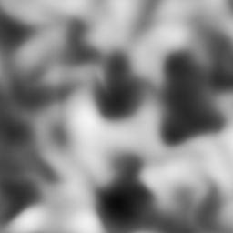
- FOAM_FRACTAL: 
  - 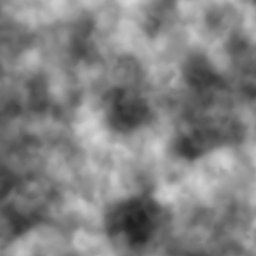
- HONEY:
  - 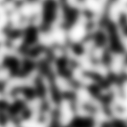
- HONEY_FRACTAL:
  - 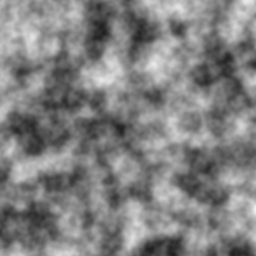
- MUTANT:
  - 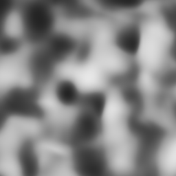
- MUTANT_FRACTAL:
  - 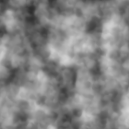


## Some Fractal Type Previews

All are 2D, using 3 octaves.

- PERLIN_FRACTAL: 
  - FBM
     - 
  - BILLOW
     - 
  - RIDGED_MULTI
     - 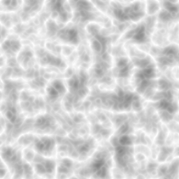
- SIMPLEX_FRACTAL: 
  - FBM
     - 
  - BILLOW
     - 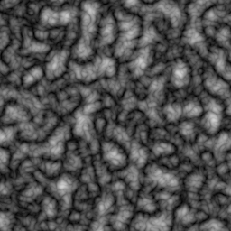
  - RIDGED_MULTI
     - 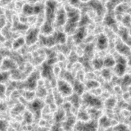
- FOAM_FRACTAL: 
  - FBM
     - 
  - BILLOW
     - 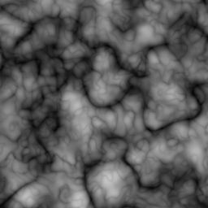
  - RIDGED_MULTI
     - 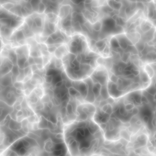
- HONEY_FRACTAL: 
  - FBM
     - 
  - BILLOW
     - 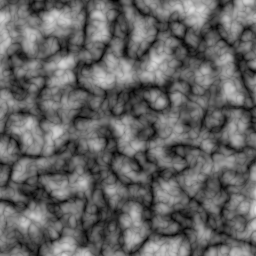
  - RIDGED_MULTI
     - 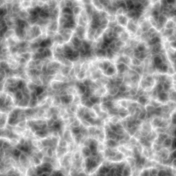
- MUTANT_FRACTAL:
  - FBM
    - 
  - BILLOW
    - 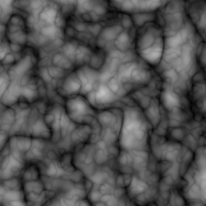
  - RIDGED_MULTI
    - 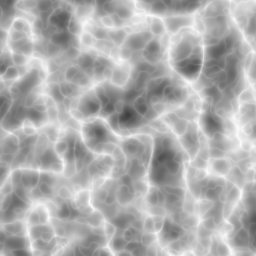
